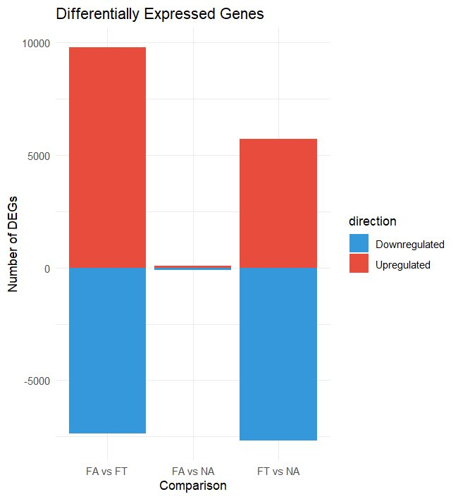
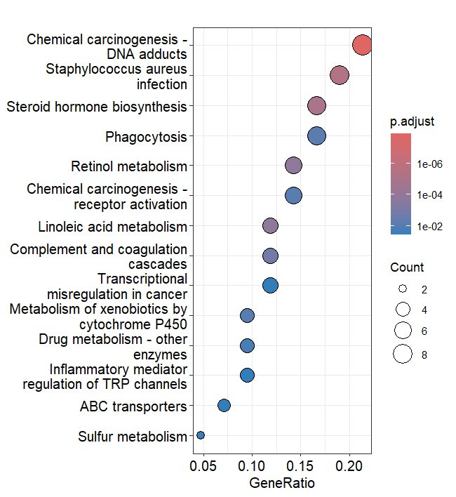
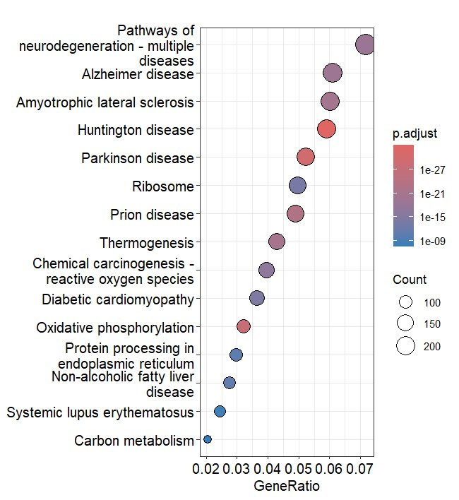
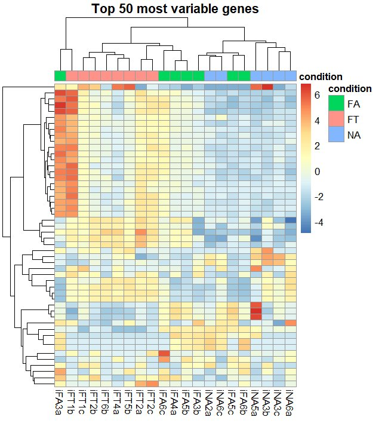

# RNA-seq Analysis Pipeline — Ileal Transcriptomics in Dietary Mouse Models

Computational pipeline for differential gene expression analysis and functional enrichment of RNA-seq data from ileal tissue in mice under different dietary conditions.

Based on the dataset from **Dantas Machado et al. (2022)**, examining the effect of dietary fat and *Akkermansia muciniphila* supplementation on the ileal transcriptome.

---

## Background

This project applies a reusable RNA-seq analysis pipeline to investigate transcriptomic differences across three dietary groups in a murine model:

| Group | Description |
|-------|-------------|
| **FA** | High-fat diet + *Akkermansia muciniphila* |
| **FT** | High-fat diet (control, no *Akkermansia*) |
| **NA** | Normal diet + *Akkermansia muciniphila* |

The pipeline performs differential expression analysis (DESeq2), followed by Gene Ontology (GO) and KEGG pathway enrichment to identify biologically relevant differences in ileal gene expression.

---

## Repository Structure

```
rnaseq-pipeline/
├── R/
│   └── pipeline.R        # Core reusable pipeline function (run_rnaseq_pipeline)
├── analysis.R            # Main script: applies pipeline to all comparisons
├── results/
│   └── plots/            # Output plots (GO and KEGG dotplots)
├── data/                 # Input data (not tracked — see Data section below)
└── README.md
```

---

## Pipeline Overview

The `run_rnaseq_pipeline()` function (in `R/pipeline.R`) runs the following steps for any pair of conditions:

1. **Differential Expression Analysis** — DESeq2 contrast, filtered by adjusted p-value and log2 fold-change thresholds
2. **GO Enrichment** — Biological Process enrichment via clusterProfiler, using BH correction
3. **KEGG Enrichment** — Pathway enrichment via clusterProfiler (organism: *Mus musculus*, `mmu`)
4. **Visualization** — Dotplots for top 15 enriched GO terms and KEGG pathways

### Function signature

```r
run_rnaseq_pipeline(dds, group1, group2, padj_cutoff = 0.05, lfc_cutoff = 1)
```

| Parameter | Type | Description |
|-----------|------|-------------|
| `dds` | DESeqDataSet | Fitted DESeq2 object |
| `group1` | character | Numerator condition |
| `group2` | character | Denominator condition |
| `padj_cutoff` | numeric | Adjusted p-value threshold (default: 0.05) |
| `lfc_cutoff` | numeric | Log2 fold-change threshold (default: 1) |

Returns a named list with DEG tables, enrichment results, and plots.

---

## Dependencies

```r
install.packages("BiocManager")
BiocManager::install(c("DESeq2", "clusterProfiler", "org.Mm.eg.db"))
install.packages("ggplot2")
```

| Package | Version tested | Purpose |
|---------|---------------|---------|
| DESeq2 | 1.40+ | Differential expression |
| clusterProfiler | 4.8+ | GO and KEGG enrichment |
| org.Mm.eg.db | 3.17+ | Mouse gene annotation |
| ggplot2 | 3.4+ | Visualization |

---

## Usage

```r
# Load pipeline
source("R/pipeline.R")

# Load your fitted DESeqDataSet
dds <- readRDS("data/dds_fitted.rds")

# Run comparison
FA_NA <- run_rnaseq_pipeline(dds, group1 = "FA", group2 = "NA")

# Access results
FA_NA$results_significant   # Filtered DEG table
FA_NA$go_plot               # GO enrichment dotplot
FA_NA$kegg_plot             # KEGG enrichment dotplot
```

---

## Results

### Differentially Expressed Genes — Overview



Summary of upregulated (red) and downregulated (blue) DEGs across all three pairwise comparisons. The FA vs FT contrast shows the largest transcriptomic response (~10,000 DEGs total), while FA vs NA produces minimal differential expression, suggesting that *Akkermansia muciniphila* supplementation has limited transcriptomic impact under normal dietary conditions compared to the strong effect of dietary fat.

---

### KEGG Pathway Enrichment — FA vs FT



Top 15 enriched KEGG pathways in the FA vs FT comparison. The most significantly enriched pathway is Chemical carcinogenesis – DNA adducts (GeneRatio ~0.21, p.adjust < 1e-6), followed by Staphylococcus aureus infection and Steroid hormone biosynthesis. The presence of immune-related (Phagocytosis, Complement and coagulation cascades) and metabolic pathways (Retinol metabolism, Linoleic acid metabolism, Cytochrome P450) suggests broad transcriptomic remodeling in ileal tissue under high-fat dietary conditions with *Akkermansia* supplementation.

---

### KEGG Pathway Enrichment — FT vs NA



Top 15 enriched KEGG pathways in the FT vs NA comparison. Pathways associated with neurodegeneration (Alzheimer disease, Parkinson disease, Huntington disease, ALS) dominate the enrichment, alongside Oxidative phosphorylation and Ribosome pathways. These results point to mitochondrial dysfunction and proteostatic stress as key transcriptomic signatures of high-fat diet without *Akkermansia* supplementation, consistent with known effects of dietary fat on gut-brain axis signaling.

---

### Heatmap — Top 50 Most Variable Genes



Hierarchical clustering heatmap of the top 50 most variable genes across all samples, colored by normalized expression (red = high, blue = low). Samples cluster clearly by dietary condition (FA = green, FT = pink, NA = blue), confirming strong condition-driven transcriptomic separation. A subset of genes shows markedly elevated expression in FT samples, while FA and NA share a partially overlapping expression profile, consistent with the low DEG count observed in the FA vs NA comparison.

---
##  Running with Docker (Recommended)
The analysis environment is fully containerized using the official Bioconductor Docker image (Release 3.18), ensuring complete reproducibility of R and Bioc package versions.

**Prerequisites:** 
- Docker installed on your machine.
- The processed data (`dds_fitted.rds`) must be placed in the local `data/` directory.

**1. Build the image:**
```bash
docker build -t rnaseq-mouse-pipeline .
```
**2. Run the analysis:**
Run this command from the root directory of the repository. It mounts your local data/ and results/ folders into the container.
```
docker run --rm \
  -v ${PWD}/data:/rnaseq/data \
  -v ${PWD}/results:/rnaseq/results \
  rnaseq-mouse-pipeline
  ```

## Data

Raw data is not included in this repository. The original dataset is publicly available:

> Dantas Machado, A.C. et al. (2022). *Diet and gut microbiota composition shape the ileal transcriptome in mice.* [Add full reference and GEO accession if available]

Quantification was performed using **Kallisto** (pseudoalignment), followed by import into R via **tximport** and normalization/analysis with **DESeq2**.

---

## Author

**Santi Isgrò**
BSc in Computer Science — Università degli Studi di Catania
Thesis work conducted at Universidad de Cantabria (Spain)

---

## License

MIT License — feel free to reuse and adapt with attribution.
